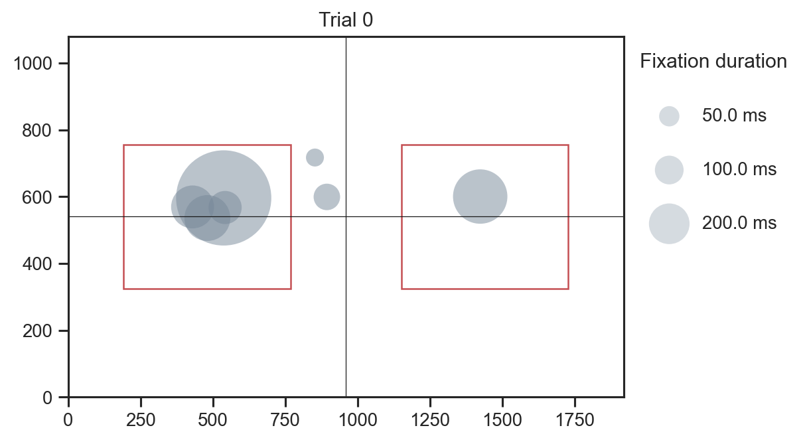
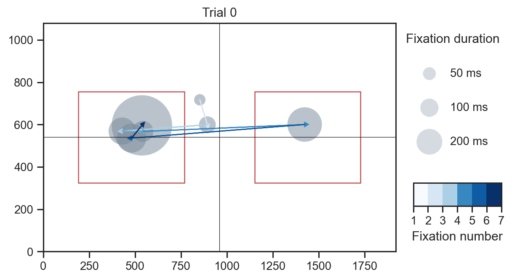
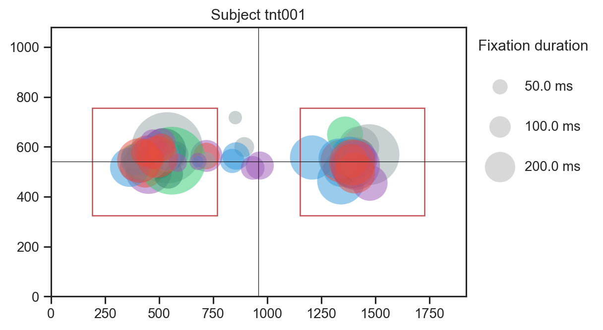

# eyeplot

A utility for processing Eyelink ASC files (converted from EDF) using python (3).  

Fixation data, interest areas, and screen dimensions are extracted.  

Fixation data (duration, average position, and whether the fixation is within an interest area) are saved in pandas dataframes and can be written to csv files.  

Three plotting functions are included for visualization of interest areas, fixations during single trials, and fixations across trials.  
One function draws colored arrows between fixations to illustrate eye movements over time.  

See the jupyter notebook for code examples and additional plots.  

### Fixations during a single trial  
  

### Fixations during a single trial with arrows showing eye movements over time
 

### Fixations for a single subject across all trials  
  
